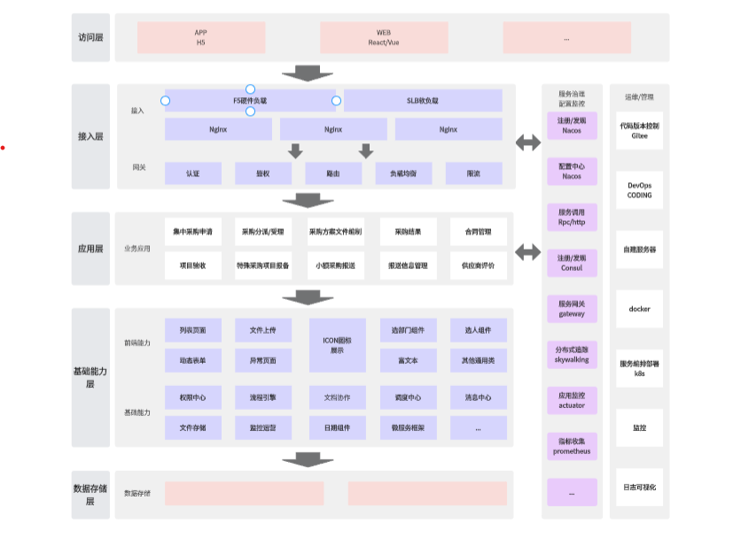

    graph TD
        %% 用户界面层
        subgraph 用户界面层
            direction TB
            UI1[用户输入SQL查询]
            UI2[显示检查结果和风险等级]
            UI1 --> UI2
        end

        %% 应用逻辑层
        subgraph 应用逻辑层
            direction TB
            AL1[接收用户输入的SQL查询]
            AL2[调用AI模型进行分析]
            AL3[处理分析结果，生成风险报告]
            AL4[存储和分析历史数据]
            AL1 --> AL2 --> AL3 --> AL4
        end

        %% AI分析引擎层
        subgraph AI分析引擎层
            direction TB
            AI1[SQL语法解析器]
            AI2[SQL注入模式识别模块]
            AI3[安全规则库]
            AI4[AI模型训练与推理模块]
            AI5[大型语言模型]
            AI6[深度学习模型]
            AI7[机器学习模型]
            AI8[模型更新与优化机制]
            AI4 --> AI5
            AI4 --> AI6
            AI4 --> AI7
            AI1 --> AI2 --> AI3 --> AI4
            AI4 --> AI8
        end

        %% 数据存储层
        subgraph 数据存储层
            direction TB
            DS1[用户数据存储]
            DS2[SQL查询历史存储]
            DS3[安全规则库存储]
            DS4[检查结果和风险等级存储]
            DS5[模型参数和状态存储]
            DS1 --> DS2 --> DS3 --> DS4 --> DS5
        end

        %% 安全和监控层
        subgraph 安全和监控层
            direction TB
            SM1[访问控制与身份验证]
            SM2[数据加密与安全传输]
            SM3[系统监控与日志记录]
            SM4[异常检测与报警系统]
            SM5[安全审计与合规性检查]
            SM1 --> SM2 --> SM3 --> SM4 --> SM5
        end

        %% 基础设施层
        subgraph 基础设施层
            direction TB
            IF1[服务器/云服务部署]
            IF2[网络设施]
            IF3[数据中心和CDN服务]
            IF4[灾难恢复与备份机制]
            IF1 --> IF2 --> IF3 --> IF4
        end

        %% 层级关系
        UI1 --> AL1
        AL2 --> AI1
        AL4 --> DS1
        DS1 --> SM1
        SM1 --> IF1

graph TD
    A[开始使用SQL安全检查Agent] --> B[登录/注册]
    B --> C[登录成功]
    C --> D[进入主界面]
    D --> E[开始SQL检查]
    D --> F[查看历史记录]
    D --> G[查看规则库]
    D --> H[帮助与反馈]
    D --> I[退出登录]

    E --> E1[输入SQL查询]
    E1 --> E2[提交SQL查询]
    E2 --> E3[等待检查结果]
    E3 --> E4[查看检查结果]
    E4 --> E5[风险等级]
    E4 --> E6[安全问题]
    E4 --> E7[优化建议]
    E4 --> D

    F --> F1[查看历史记录]
    F1 --> F2[筛选/排序记录]
    F1 --> F3[查看详细检查结果]
    F3 --> D

    G --> G1[查看规则库]
    G1 --> G2[浏览规则分类]
    G1 --> G3[反馈规则建议]
    G3 --> H

    H --> H1[查看帮助文档]
    H --> H2[联系客服]
    H --> H3[反馈建议]
    H3 --> H4[提交反馈]
    H4 --> H5[收到反馈确认]
    H5 --> D

    I --> I1[确认退出]
    I1 --> I2[返回登录页面]
    I2 --> I3[结束使用]

API设计
1. API Endpoint
Endpoint: /api/sql/check
Method: POST
Description: 提交SQL查询进行检查，并返回检查结果和优化建议。
2. Request Body
请求体将包含需要检查的SQL查询语句。以下是JSON格式的请求体结构：
JSON
复制
{
    "sql_query": "SELECT * FROM users WHERE id = ?"
}
sql_query (string, required): 需要检查的SQL查询语句。
3. Response
返回的响应体将包含检查结果和优化建议。以下是JSON格式的响应体结构：
JSON
复制
{
    "status": "success",
    "message": "SQL检查完成",
    "results": {
        "risk_level": "low",
        "security_issues": [
            {
                "issue": "SQL注入风险",
                "description": "参数化查询使用不当可能导致SQL注入",
                "severity": "medium",
                "location": "WHERE id = ?"
            }
        ],
        "optimization_suggestions": [
            {
                "suggestion": "使用索引优化查询",
                "description": "为`id`字段添加索引以提高查询性能",
                "expected_gain": "提高查询速度50%"
            }
        ]
    }
}
status (string): 检查状态，可能的值为success或error。
message (string): 状态描述信息。
results (object): 检查结果，包含以下字段：
risk_level (string): SQL查询的整体风险等级，可能的值为low、medium或high。
security_issues (array): 发现的安全问题列表，每个问题包含：
issue (string): 问题名称。
description (string): 问题描述。
severity (string): 问题严重性等级，可能的值为low、medium或high。
location (string): 问题出现的位置（SQL片段）。
optimization_suggestions (array): 优化建议列表，每个建议包含：
suggestion (string): 优化建议内容。
description (string): 建议描述。
expected_gain (string): 预期的优化效果。
4. Error Response
如果请求无效或检查过程中出现问题，API将返回错误响应。以下是错误响应的结构：
JSON
复制
{
    "status": "error",
    "message": "无效的SQL查询",
    "error_code": "INVALID_SQL"
}
status (string): 状态为error。
message (string): 错误描述。
error_code (string): 错误代码，用于调试和记录。
5. 示例请求和响应
示例请求
bash
复制
POST /api/sql/check
Content-Type: application/json

{
    "sql_query": "SELECT * FROM users WHERE id = ?"
}
示例成功响应
JSON
复制
{
    "status": "success",
    "message": "SQL检查完成",
    "results": {
        "risk_level": "low",
        "security_issues": [
            {
                "issue": "SQL注入风险",
                "description": "参数化查询使用不当可能导致SQL注入",
                "severity": "medium",
                "location": "WHERE id = ?"
            }
        ],
        "optimization_suggestions": [
            {
                "suggestion": "使用索引优化查询",
                "description": "为`id`字段添加索引以提高查询性能",
                "expected_gain": "提高查询速度50%"
            }
        ]
    }
}
示例错误响应
JSON
复制
{
    "status": "error",
    "message": "无效的SQL查询",
    "error_code": "INVALID_SQL"
}
6. API实现建议
后端逻辑：
接收sql_query字段。
调用SQL解析器和AI模型进行安全检查和性能分析。
根据检查结果生成JSON格式的响应。
安全性：
对输入的SQL查询进行严格的验证，避免恶意输入。
使用HTTPS协议确保数据传输的安全。
性能优化：
对复杂的SQL查询进行异步处理，避免阻塞主线程。
缓存常见查询的检查结果，减少重复计算。
通过这个设计，你可以轻松实现一个RESTful API，用于SQL查询的检查和优化。

基于刚才设计的RESTful API，我们可以构建一个用户旅程（User Journey），描述用户如何通过API完成SQL查询的提交、检查以及获取结果的过程。以下是用户旅程的详细描述和对应的Mermaid流程图代码：
用户旅程描述
用户访问API文档
用户通过访问API文档页面，了解如何使用/api/sql/check接口提交SQL查询并获取检查结果。
用户准备SQL查询
用户编写或准备需要检查的SQL查询语句。
用户发送POST请求
用户通过工具（如Postman、Curl或自定义客户端）发送一个HTTP POST请求到/api/sql/check，请求体中包含SQL查询。
API接收并处理请求
API接收请求并验证请求体是否包含有效的SQL查询。
如果请求无效，API返回错误响应。
如果请求有效，API调用后端逻辑（如SQL解析器和AI模型）进行安全检查和性能分析。
用户等待响应
用户等待API处理请求并返回结果。根据SQL的复杂性，响应时间可能从几秒到几分钟不等。
用户接收检查结果
用户收到API返回的JSON格式响应，包含SQL查询的风险等级、安全问题和优化建议。
用户解析和应用结果
用户根据返回的结果解析检查信息：
如果存在安全问题，用户根据建议修复SQL查询。
如果有优化建议，用户根据建议优化SQL查询。
用户重复检查（可选）
用户可以对修改后的SQL查询重新发送请求，以验证问题是否已解决。
用户结束旅程
用户完成SQL检查和优化后，结束使用API。
Mermaid流程图代码
以下是基于上述用户旅程的Mermaid流程图代码：
mermaid
Code
经典
手绘
请求无效

请求有效

是

否

访问API文档

准备SQL查询

发送POST请求到Unsupported markdown: codespan

API接收请求

返回错误响应

调用后端逻辑进行检查

返回检查结果

用户接收检查结果

解析检查结果

是否存在安全问题或优化建议?

根据建议修复或优化SQL查询

结束旅程

重新发送POST请求

用户结束旅程

流程图说明
访问API文档：用户了解如何使用API提交SQL查询。
准备SQL查询：用户编写或准备需要检查的SQL语句。
发送POST请求：用户通过工具发送HTTP POST请求到API。
API接收请求：API验证请求是否有效。
如果无效，返回错误响应。
如果有效，调用后端逻辑进行检查。
调用后端逻辑：API调用SQL解析器和AI模型进行安全检查和性能分析。
返回检查结果：API返回JSON格式的检查结果。
用户接收检查结果：用户收到检查结果。
解析检查结果：用户根据返回的结果分析SQL查询的安全性和性能。
根据建议修复或优化：用户根据检查结果修复或优化SQL查询。
重新发送POST请求：用户对修改后的SQL查询重新发送请求以验证结果。
结束旅程：用户完成SQL检查和优化后结束使用API。
这个用户旅程清晰地描述了用户如何通过API完成SQL查询的检查和优化过程，帮助开发者更好地理解和设计API的交互流程。

graph TD
    A[访问API文档] --> B[准备SQL查询]
    B --> C[发送POST请求到`/api/sql/check`]
    C --> D{API接收请求}
    D -->|请求无效| E[返回错误响应]
    D -->|请求有效| F[调用后端逻辑进行检查]
    F --> G[返回检查结果]
    G --> H[用户接收检查结果]
    H --> I[解析检查结果]
    I --> J{是否存在安全问题或优化建议?}
    J -->|是| K[根据建议修复或优化SQL查询]
    J -->|否| L[结束旅程]
    K --> M[重新发送POST请求]
    M --> C
    L --> N[用户结束旅程]

产品功能描述
1. SQL安全检查
功能描述：对用户提交的SQL查询进行安全检查，检测潜在的安全问题，如SQL注入、权限问题、数据泄露等。
具体实现：
使用SQL解析器分析SQL语法。
结合AI模型识别潜在的安全漏洞。
提供详细的安全问题描述和风险等级。
2. SQL性能优化
功能描述：对SQL查询进行性能分析，提供优化建议，以提高查询效率和数据库性能。
具体实现：
分析查询语句的执行计划。
提供索引优化、查询重写等建议。
预估优化后的性能提升效果。
3. 修复建议
功能描述：针对检测到的安全问题和性能问题，提供具体的修复建议和示例代码。
具体实现：
提供参数化查询、索引优化等建议。
提供示例代码，帮助用户快速修复问题。
4. 历史记录管理
功能描述：记录用户提交的SQL查询及其检查结果，方便用户查看历史记录和对比优化效果。
具体实现：
提供历史记录的筛选和排序功能。
支持查看历史查询的详细检查结果。
5. 规则库管理
功能描述：提供安全规则库，用户可以查看和管理规则，甚至自定义规则。
具体实现：
提供预定义的安全规则分类。
支持用户反馈规则建议，以便扩展规则库。
6. API接口
功能描述：提供RESTful API接口，允许用户通过程序化方式提交SQL查询并获取检查结果。
具体实现：
提供POST /api/sql/check接口，接收SQL查询并返回检查结果和建议。
支持JSON格式的请求和响应。
7. 用户界面
功能描述：提供Web界面或桌面应用界面，方便用户手动输入SQL查询并查看检查结果。
具体实现：
提供简洁直观的用户界面。
支持多种输入方式（手动输入、粘贴、文件上传）。
显示检查结果的可视化界面。
8. 安全与监控
功能描述：确保用户数据的安全性和隐私，同时监控系统运行状态。
具体实现：
提供访问控制和身份验证。
数据加密与安全传输（使用HTTPS）。
系统监控与日志记录，异常检测与报警。
产品架构设计
1. 架构分层
产品的整体架构分为以下几层：
用户界面层 (User Interface Layer)
功能：提供用户交互界面，包括Web界面和桌面应用界面。
技术栈：HTML/CSS/JavaScript（Web界面），Electron（桌面应用）。
主要模块：
SQL查询输入框。
检查结果展示。
历史记录管理。
规则库管理。
应用逻辑层 (Application Logic Layer)
功能：接收用户输入的SQL查询，调用AI模型进行分析，处理分析结果并生成报告。
技术栈：Python/Java/Node.js（后端语言）。
主要模块：
API接口管理。
SQL解析器。
AI模型调用。
历史记录存储与管理。
用户认证与授权。
AI分析引擎层 (AI Analysis Engine Layer)
功能：提供SQL语法解析、安全规则匹配、AI模型推理等核心功能。
技术栈：Python（AI模型），TensorFlow/PyTorch（深度学习框架）。
主要模块：
SQL语法解析器。
安全规则库。
AI模型（SQL注入检测、性能分析）。
模型训练与更新机制。
数据存储层 (Data Storage Layer)
功能：存储用户数据、SQL查询历史、检查结果、安全规则库等。
技术栈：MySQL/PostgreSQL（关系型数据库），Redis（缓存）。
主要模块：
用户数据存储。
SQL查询历史记录。
检查结果存储。
安全规则库存储。
模型参数存储。
安全与监控层 (Security & Monitoring Layer)
功能：确保系统的安全性，监控系统运行状态，记录日志，检测异常。
技术栈：Nginx（HTTPS），ELK Stack（日志管理），Prometheus/Grafana（监控）。
主要模块：
访问控制与身份验证。
数据加密与安全传输。
系统监控与日志记录。
异常检测与报警。
安全审计与合规性检查。
基础设施层 (Infrastructure Layer)
功能：提供底层的硬件和软件资源，支持系统的运行。
技术栈：AWS/Azure/GCP（云服务），Docker/Kubernetes（容器化部署）。
主要模块：
服务器/云服务部署。
网络设施。
数据中心和CDN服务。
灾难恢复与备份机制。
2. 架构组件交互流程
以下是各层之间的交互流程：
用户提交SQL查询：
用户通过Web界面或API接口提交SQL查询。
应用逻辑层接收查询并验证用户身份。
SQL解析与分析：
应用逻辑层将SQL查询传递给AI分析引擎层。
SQL解析器分析查询语法。
AI模型进行安全和性能分析。
生成检查结果：
AI分析引擎层将分析结果返回给应用逻辑层。
应用逻辑层处理结果，生成风险报告和修复建议。
存储与反馈：
检查结果存储到数据存储层。
应用逻辑层将结果返回给用户界面或API客户端。
安全与监控：
安全与监控层对用户的操作和系统运行状态进行监控。
记录日志，检测异常行为并触发报警。

graph TD
    UI[用户界面层] --> AL[应用逻辑层]
    AL --> AIE[AI分析引擎层]
    AIE --> DS[数据存储层]
    AL --> DS
    AL --> SM[安全与监控层]
    SM --> DS
    SM --> IL[基础设施层]
    IL --> DS

    style UI fill:#f9f,stroke:#333,stroke-width:2px
    style AL fill:#ccf,stroke:#333,stroke-width:2px
    style AIE fill:#cfc,stroke:#333,stroke-width:2px
    style DS fill:#fcf,stroke:#333,stroke-width:2px
    style SM fill:#fcc,stroke:#333,stroke-width:2px
    style IL fill:#f9f,stroke:#333,stroke-width:2px

Avatar
好的！以下是对SQL安全检查与优化产品的功能和架构的详细整理和描述。
产品功能描述
1. SQL安全检查
功能描述：对用户提交的SQL查询进行安全检查，检测潜在的安全问题，如SQL注入、权限问题、数据泄露等。
具体实现：
使用SQL解析器分析SQL语法。
结合AI模型识别潜在的安全漏洞。
提供详细的安全问题描述和风险等级。
2. SQL性能优化
功能描述：对SQL查询进行性能分析，提供优化建议，以提高查询效率和数据库性能。
具体实现：
分析查询语句的执行计划。
提供索引优化、查询重写等建议。
预估优化后的性能提升效果。
3. 修复建议
功能描述：针对检测到的安全问题和性能问题，提供具体的修复建议和示例代码。
具体实现：
提供参数化查询、索引优化等建议。
提供示例代码，帮助用户快速修复问题。
4. 历史记录管理
功能描述：记录用户提交的SQL查询及其检查结果，方便用户查看历史记录和对比优化效果。
具体实现：
提供历史记录的筛选和排序功能。
支持查看历史查询的详细检查结果。
5. 规则库管理
功能描述：提供安全规则库，用户可以查看和管理规则，甚至自定义规则。
具体实现：
提供预定义的安全规则分类。
支持用户反馈规则建议，以便扩展规则库。
6. API接口
功能描述：提供RESTful API接口，允许用户通过程序化方式提交SQL查询并获取检查结果。
具体实现：
提供POST /api/sql/check接口，接收SQL查询并返回检查结果和建议。
支持JSON格式的请求和响应。
7. 用户界面
功能描述：提供Web界面或桌面应用界面，方便用户手动输入SQL查询并查看检查结果。
具体实现：
提供简洁直观的用户界面。
支持多种输入方式（手动输入、粘贴、文件上传）。
显示检查结果的可视化界面。
8. 安全与监控
功能描述：确保用户数据的安全性和隐私，同时监控系统运行状态。
具体实现：
提供访问控制和身份验证。
数据加密与安全传输（使用HTTPS）。
系统监控与日志记录，异常检测与报警。
产品架构设计
1. 架构分层
产品的整体架构分为以下几层：
用户界面层 (User Interface Layer)
功能：提供用户交互界面，包括Web界面和桌面应用界面。
技术栈：HTML/CSS/JavaScript（Web界面），Electron（桌面应用）。
主要模块：
SQL查询输入框。
检查结果展示。
历史记录管理。
规则库管理。
应用逻辑层 (Application Logic Layer)
功能：接收用户输入的SQL查询，调用AI模型进行分析，处理分析结果并生成报告。
技术栈：Python/Java/Node.js（后端语言）。
主要模块：
API接口管理。
SQL解析器。
AI模型调用。
历史记录存储与管理。
用户认证与授权。
AI分析引擎层 (AI Analysis Engine Layer)
功能：提供SQL语法解析、安全规则匹配、AI模型推理等核心功能。
技术栈：Python（AI模型），TensorFlow/PyTorch（深度学习框架）。
主要模块：
SQL语法解析器。
安全规则库。
AI模型（SQL注入检测、性能分析）。
模型训练与更新机制。
数据存储层 (Data Storage Layer)
功能：存储用户数据、SQL查询历史、检查结果、安全规则库等。
技术栈：MySQL/PostgreSQL（关系型数据库），Redis（缓存）。
主要模块：
用户数据存储。
SQL查询历史记录。
检查结果存储。
安全规则库存储。
模型参数存储。
安全与监控层 (Security & Monitoring Layer)
功能：确保系统的安全性，监控系统运行状态，记录日志，检测异常。
技术栈：Nginx（HTTPS），ELK Stack（日志管理），Prometheus/Grafana（监控）。
主要模块：
访问控制与身份验证。
数据加密与安全传输。
系统监控与日志记录。
异常检测与报警。
安全审计与合规性检查。
基础设施层 (Infrastructure Layer)
功能：提供底层的硬件和软件资源，支持系统的运行。
技术栈：AWS/Azure/GCP（云服务），Docker/Kubernetes（容器化部署）。
主要模块：
服务器/云服务部署。
网络设施。
数据中心和CDN服务。
灾难恢复与备份机制。
2. 架构组件交互流程
以下是各层之间的交互流程：
用户提交SQL查询：
用户通过Web界面或API接口提交SQL查询。
应用逻辑层接收查询并验证用户身份。
SQL解析与分析：
应用逻辑层将SQL查询传递给AI分析引擎层。
SQL解析器分析查询语法。
AI模型进行安全和性能分析。
生成检查结果：
AI分析引擎层将分析结果返回给应用逻辑层。
应用逻辑层处理结果，生成风险报告和修复建议。
存储与反馈：
检查结果存储到数据存储层。
应用逻辑层将结果返回给用户界面或API客户端。
安全与监控：
安全与监控层对用户的操作和系统运行状态进行监控。
记录日志，检测异常行为并触发报警。
架构图（Mermaid格式）
以下是基于Mermaid语法的架构图代码：
mermaid
Code
经典
手绘
graph TD
    UI[用户界面层] --> AL[应用逻辑层]
    AL --> AIE[AI分析引擎层]
    AIE --> DS[数据存储层]
    AL --> DS
    AL --> SM[安全与监控层]
    SM --> DS
    SM --> IL[基础设施层]
    IL --> DS

    style UI fill:#f9f,stroke:#333,stroke-width:2px
    style AL fill:#ccf,stroke:#333,stroke-width:2px
    style AIE fill:#cfc,stroke:#333,stroke-width:2px
    style DS fill:#fcf,stroke:#333,stroke-width:2px
    style SM fill:#fcc,stroke:#333,stroke-width:2px
    style IL fill:#f9f,stroke:#333,stroke-width:2px
架构图说明
用户界面层：与用户直接交互，接收SQL查询并展示结果。
应用逻辑层：处理用户请求，调用AI分析引擎，生成报告。
AI分析引擎层：核心分析模块，负责SQL解析、安全检查和性能分析。
数据存储层：存储用户数据、历史记录、检查结果和安全规则。
安全与监控层：负责系统安全、监控和日志记录。
基础设施层：提供底层的硬件和软件资源支持。